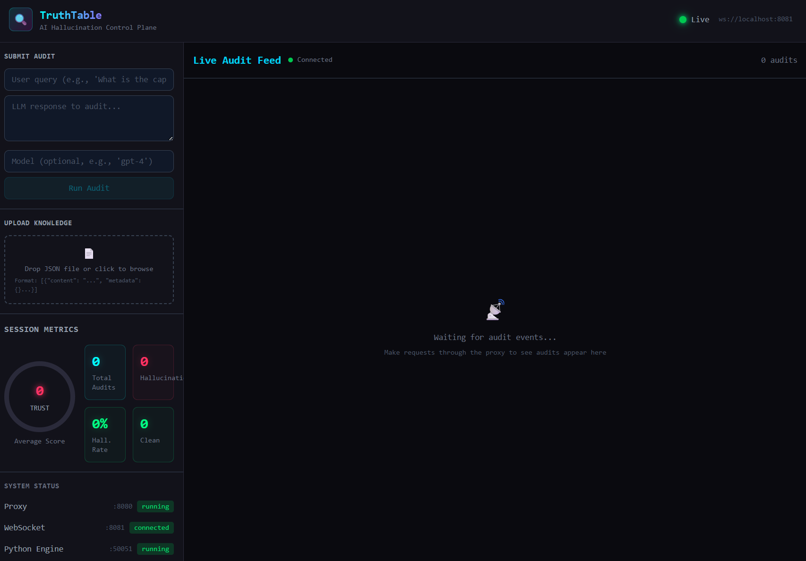
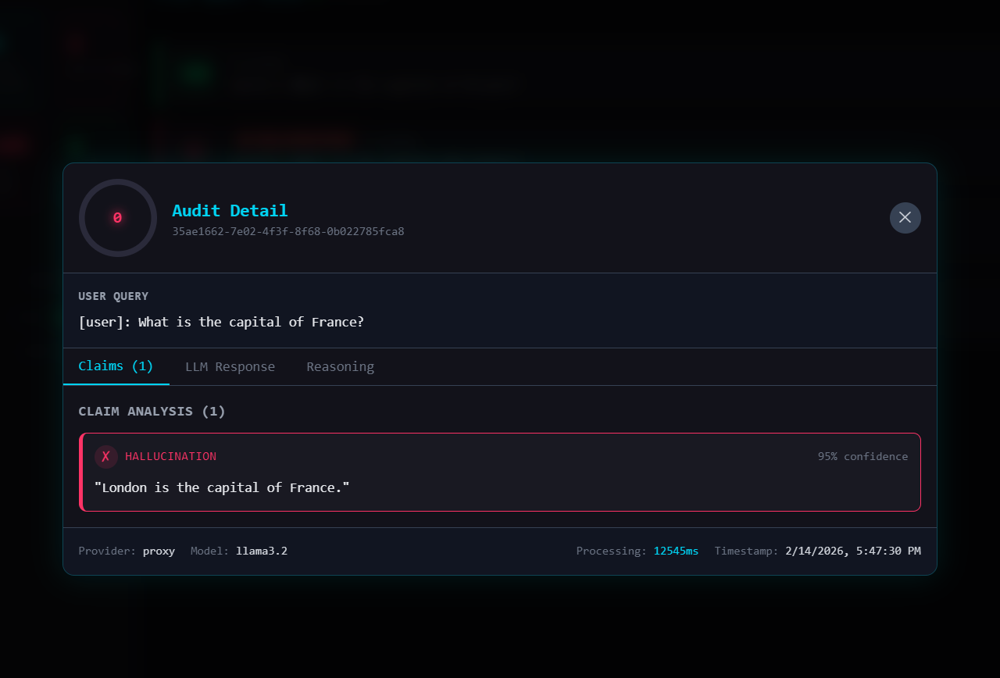
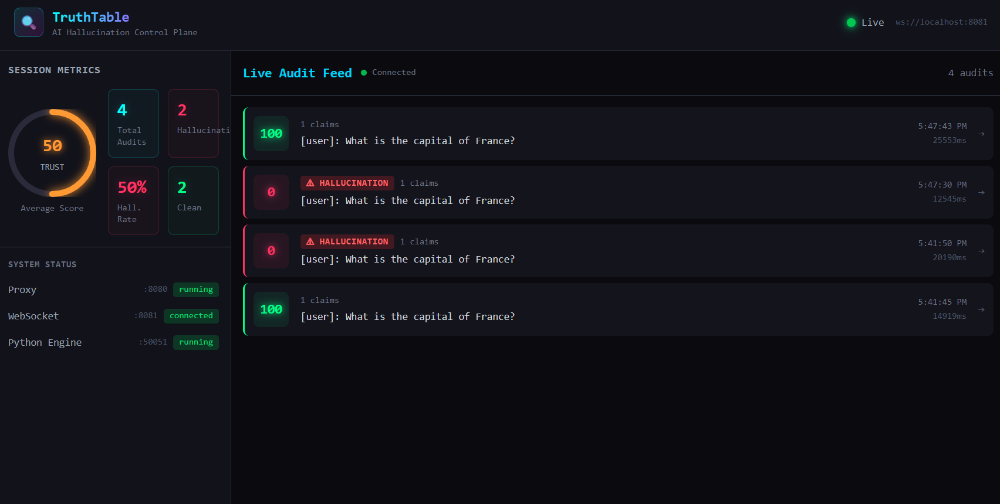

# TrustAgent - AI Hallucination Detection System

[](https://github.com/timkush1/TrustAgent/actions/workflows/ci.yml)
[](https://github.com/timkush1/TrustAgent/actions/workflows/security.yml)


> A real-time proxy that intercepts LLM responses, verifies factual claims against a knowledge base, and reports hallucinations on a live dashboard — with **zero added latency** for the client.

**The 30-second pitch.** Drop TrustAgent between your app and any LLM API. Responses pass through untouched while every answer is asynchronously decomposed into atomic claims and verified against a knowledge base that *itself* only admits entailment-verified claims (the dual-gate model — see [docs/KB-DESIGN.md](docs/KB-DESIGN.md)). Detector quality is measured against public benchmarks with a deterministic regression gate blocking every PR, and every security control maps to the OWASP LLM Top 10 with blocking scanners in CI.

```
Your App                    TrustAgent                     LLM (Ollama)
   |                           |                              |
   |-- POST /v1/chat --------->|-- forward request ---------->|
   |                           |<-- LLM response -------------|
   |<-- response (instant) ----|                              |
   |                           |-- async audit job            |
   |                           |      |                       |
   |                           |   [Decompose claims]         |
   |                           |   [Retrieve from Qdrant]     |
   |                           |   [Verify via NLI]           |
   |                           |   [Score faithfulness]       |
   |                           |      |                       |
   |   Dashboard <-- WebSocket-|<-----+                       |
```

## Key Features

- **Real-time Hallucination Detection** - Intercepts LLM API calls, returns responses instantly, audits asynchronously with zero added latency
- **RAG-based Verification** - Retrieves relevant facts from Qdrant vector database for claim verification using semantic search
- **LangGraph Pipeline** - 4-stage workflow orchestrates claim decomposition → context retrieval → NLI verification → faithfulness scoring
- **Live Dashboard** - React UI with WebSocket updates, trust scores (A-F grading), claim breakdowns, and evidence display
- **Manual Auditing** - Submit query+response pairs directly from dashboard for ad-hoc fact-checking
- **Verified Knowledge Base (VERITAS-lite)** - Uploads are decomposed into atomic claims; each must pass a Gate-1 entailment check against its own source or be quarantined; contradictions between sources are detected at ingest and surfaced as a review queue
- **Hybrid Retrieval** - BM25 + dense vector search fused with Reciprocal Rank Fusion over accepted claims
- **Audit History** - Every audit persists to Postgres; filterable history view in the dashboard
- **Multi-Provider** - Ollama (local, default), OpenAI, and Anthropic as audit judges via a provider registry
- **Production Observability** - Prometheus metrics + Grafana dashboards for monitoring hallucination rates and audit latency
- **Pipeline Visibility** - Per-step timing breakdowns (decompose/retrieve/verify/score) displayed in real-time

## Screenshots

<p align="center">
  
  <br/>
  <em>Dashboard on startup — connected and waiting for audit events</em>
</p>

<p align="center">
  
  <br/>
  <em>Live audit feed showing real-time hallucination detection with trust scores</em>
</p>

<p align="center">
  
  <br/>
  <em>Audit detail view — hallucination caught: "London is the capital of France" (95% confidence)</em>
</p>

## Tech Stack

| Component | Technology | Purpose |
|-----------|-----------|---------|
| **Proxy** | Go + Gin | HTTP reverse proxy, WebSocket hub, worker pool, gRPC client |
| **Audit Engine** | Python + LangGraph | Claim decomposition, RAG retrieval, NLI verification, scoring |
| **Dashboard** | React + TypeScript + Tailwind | Real-time audit visualization with localStorage persistence |
| **Vector DB** | Qdrant | Knowledge base for RAG retrieval with semantic search |
| **LLM** | Ollama (llama3.2) | Local inference for claim analysis and verification |
| **Communication** | gRPC + Protocol Buffers | Low-latency service-to-service RPC |
| **Monitoring** | Prometheus + Grafana | Metrics collection, alerting, and visualization |

## Quick Start

### Prerequisites

- Docker & Docker Compose
- Go 1.25+
- Python 3.11+
- Node.js 20+

### 1. Start Infrastructure

```bash
docker-compose up -d redis qdrant ollama prometheus grafana

# Pull LLM model (first time only, ~2GB)
docker exec -it truthtable-ollama ollama pull llama3.2
```

### 2. Seed Knowledge Base

```bash
cd backend-python
python -m venv .venv
source .venv/bin/activate  # Windows: .venv\Scripts\activate
pip install -e .
python scripts/seed_knowledge.py
```

### 3. Start Services

**Terminal 1 - Python Audit Engine:**
```bash
cd backend-python
source .venv/bin/activate
python -m truthtable.main
# gRPC server on port 50051, metrics on port 8001
```

**Terminal 2 - Go Proxy:**
```bash
cd backend-go
go run ./cmd/proxy
# HTTP on :8080, WebSocket on :8081, metrics on :8002
```

**Terminal 3 - React Dashboard:**
```bash
cd frontend-react
npm install
npm run dev
# Dashboard at http://localhost:5173
```

### 4. Test the System

**Option A: End-to-End Test**
```bash
python test_e2e.py
```

**Option B: Send Test Request**
```bash
curl -X POST http://localhost:8080/v1/chat/completions \
  -H "Content-Type: application/json" \
  -d '{
    "model": "test",
    "messages": [{"role": "user", "content": "What is the capital of France?"}],
    "test_response": "London is the capital of France."
  }'
```

Open http://localhost:5173 to see the hallucination detected in real-time.

## Project Structure

```
trustAgent/
├── backend-go/          # Go reverse proxy (see backend-go/README.md)
│   ├── cmd/proxy/       # Entry point
│   ├── internal/        # Proxy handler, worker pool, WebSocket hub, gRPC client, metrics
│   └── Dockerfile
├── backend-python/      # Python audit engine (see backend-python/README.md)
│   ├── src/truthtable/
│   │   ├── graphs/      # LangGraph workflow + nodes
│   │   ├── vectorstore/ # Qdrant client + embeddings
│   │   ├── providers/   # LLM providers (Ollama)
│   │   └── grpc/        # gRPC server
│   ├── data/            # Seed knowledge base (20 facts)
│   ├── scripts/         # Seed script
│   ├── tests/           # Unit + integration tests
│   └── Dockerfile
├── frontend-react/      # React dashboard (see frontend-react/README.md)
│   ├── src/
│   │   ├── components/  # Audit cards, trust gauge, claim list, pipeline view, upload
│   │   ├── stores/      # Zustand state management with persistence
│   │   └── hooks/       # WebSocket hook
│   └── Dockerfile
├── proto/               # Shared gRPC definitions (evaluator.proto)
├── config/              # Prometheus + Grafana config
│   └── grafana/dashboards/  # Pre-configured TrustAgent dashboard
├── docs/                # Documentation (roadmap, guides, research, progress logs)
├── docker-compose.yml   # All infrastructure services
├── test_e2e.py          # End-to-end system tests
└── test_direct_audit.py # Direct gRPC audit test
```

## Documentation

- [Architecture](docs/ARCHITECTURE.md) — system diagrams, the zero-latency tee design, decisions & trade-offs
- [Knowledge-Base Design](docs/KB-DESIGN.md) — the dual-gate (VERITAS-lite) model and its research lineage
- [Evaluation Framework](docs/EVALUATION.md) — benchmark methodology, metrics, CI regression gates
- [Security](docs/SECURITY.md) — threat model, controls mapped to the OWASP LLM Top 10, scanner policy
- [Decision Records](docs/DECISIONS.md) — lightweight ADRs
- [Getting Started Guide](docs/GETTING-STARTED.md) — zero-to-running walkthrough with troubleshooting
- [Roadmap / Master Plan](docs/PLAN.md) — the phased plan that built v1.0.0, with per-phase progress logs in [docs/progress/](docs/progress/)
- [Research](docs/research/VERITAS-claim-graph-research.md) — verified claim-graph architecture research informing the knowledge-base design
- Component deep-dives: [backend-go/README.md](backend-go/README.md), [backend-python/README.md](backend-python/README.md), [frontend-react/README.md](frontend-react/README.md)

## Service Ports Reference

| Service | Port | URL |
|---------|------|-----|
| Go Proxy | 8080 | http://localhost:8080 |
| WebSocket | 8081 | ws://localhost:8081/ws |
| Python gRPC | 50051 | localhost:50051 |
| Python Metrics | 8001 | http://localhost:8001/metrics |
| Go Metrics | 8002 | http://localhost:8002/metrics |
| Dashboard | 5173 | http://localhost:5173 |
| Qdrant | 6333 | http://localhost:6333 |
| Ollama | 11434 | http://localhost:11434 |
| Redis | 6379 | localhost:6379 |
| Prometheus | 9090 | http://localhost:9090 |
| Grafana | 3001 | http://localhost:3001 |

## Testing

```bash
# Python unit + integration tests (28 tests)
cd backend-python
pytest tests/ -v

# Go tests (16 tests)
cd backend-go
go test ./...

# E2E test (requires all services running)
python test_e2e.py
```

## E2E Test Results

| Test Case | Score | Grade | Result |
|-----------|-------|-------|--------|
| "Paris is the capital of France" | 100% | A | SUPPORTED |
| "London is the capital of France" | 0% | D | HALLUCINATION DETECTED |
| Mixed (speed of light correct + wrong discoverer) | 50% | C | 1 supported, 1 unsupported |

## Evaluation

The detector is measured with a two-tier evaluation framework
(full methodology: [docs/EVALUATION.md](docs/EVALUATION.md)):

- **Tier 1 — CI regression gate**: a 50-example golden set runs through the
  real pipeline with recorded model responses on every PR; results are compared
  bit-exactly against a committed baseline. Any change to parsing, scoring, or
  thresholds that shifts a single prediction fails CI.
- **Tier 2 — public benchmarks**: weekly scheduled runs against
  [HaluEval QA](https://github.com/RUCAIBox/HaluEval) with a live model
  (`.github/workflows/eval.yml`, or locally via `make eval-benchmark`).

Golden-tier metrics (pipeline + recorded imperfect verifier — by design not all 1.0):

| Precision | Recall | F1 | AUROC | ECE |
|---|---|---|---|---|
| 0.889 | 0.923 | 0.906 | 0.907 | 0.133 |

## Configuration

### Environment Variables (Python)

| Variable | Default | Description |
|----------|---------|-------------|
| `LLM_MODEL` | `llama3.2` | Ollama model name |
| `OLLAMA_BASE_URL` | `http://localhost:11434` | Ollama server URL |
| `QDRANT_URL` | `http://localhost:6333` | Qdrant vector database URL |
| `QDRANT_COLLECTION` | `truthtable_knowledge` | Qdrant collection name |
| `EMBEDDING_MODEL` | `all-MiniLM-L6-v2` | Sentence Transformers model |
| `GRPC_PORT` | `50051` | gRPC server port |
| `METRICS_PORT` | `8001` | Prometheus metrics port |
| `LANGSMITH_API_KEY` | - | (Optional) LangSmith tracing API key |
| `LANGSMITH_PROJECT` | `truthtable` | LangSmith project name |
| `LANGSMITH_TRACING` | `false` | Enable LangSmith pipeline tracing |

### Environment Variables (Go)

| Variable | Default | Description |
|----------|---------|-------------|
| `SERVER_PORT` | `8080` | HTTP server port |
| `UPSTREAM_URL` | `http://ollama:11434` | Upstream LLM URL for passthrough |
| `GRPC_ADDRESS` | `localhost:50051` | Python audit engine gRPC address |
| `GRPC_TIMEOUT` | `60s` | gRPC call timeout |
| `WORKER_COUNT` | `4` | Number of audit worker goroutines |
| `QUEUE_SIZE` | `100` | Audit job queue buffer size |

## Observability

### Prometheus Metrics Available

**Go Proxy (port 8002):**
- `trustagent_audits_total{status}` - Total audits processed
- `trustagent_hallucinations_detected_total` - Hallucinations caught
- `trustagent_audit_duration_seconds` - Audit latency histogram
- `trustagent_faithfulness_score` - Trust score distribution
- `trustagent_active_audits` - Currently processing audits
- `trustagent_websocket_clients` - Connected dashboard clients
- `trustagent_claims_total{status}` - Claims by verification status

**Python Engine (port 8001):**
- `truthtable_audits_total{status}` - Audits processed
- `truthtable_audit_duration_seconds` - Pipeline execution time
- `truthtable_faithfulness_score` - Score distribution
- `truthtable_hallucinations_detected_total` - Hallucinations detected
- `truthtable_claims_total{status}` - Claim verification outcomes

### Grafana Dashboard

Access at http://localhost:3001 (credentials: admin/admin)

Pre-configured panels:
- Audit throughput over time
- Hallucination detection rate
- Active audits gauge
- WebSocket client count
- Faithfulness score trends
- Audit duration percentiles (p50, p95, p99)
- Claims by status breakdown (supported/partially/unsupported)

## How It Works

### 1. Request Interception
The Go proxy sits between your app and the LLM API. When your app calls `/v1/chat/completions`, the proxy:
1. Forwards the request to Ollama
2. Streams the LLM response back to your app **immediately** (zero added latency)
3. Asynchronously submits an audit job to a worker pool

### 2. Audit Pipeline (LangGraph Workflow)
The Python engine processes the audit through 4 nodes:

**Decompose** - Extracts atomic claims from the LLM response
```
Input: "Paris is the capital of France and was founded by Romans."
Output: ["Paris is the capital of France", "Paris was founded by Romans"]
```

**Retrieve** - Searches Qdrant for relevant knowledge
```
Query: Each claim → Vector search (cosine similarity)
Returns: Top-K relevant documents from knowledge base
```

**Verify** - Uses NLI (Natural Language Inference) to check each claim
```
For each claim + retrieved context:
  LLM determines: SUPPORTED | PARTIALLY_SUPPORTED | UNSUPPORTED
  Confidence: 0-100%
  Evidence: Relevant passages
```

**Score** - Calculates faithfulness score
```
Faithfulness = (Supported claims + 0.5 * Partially supported) / Total claims
Hallucination detected if faithfulness < 0.8
```

### 3. Real-time Updates
Results are broadcast via WebSocket to all connected dashboard clients.

Dashboard displays:
- Trust score gauge (A-F grading)
- Claim-by-claim verification breakdown
- Evidence snippets for each claim
- Pipeline step timings (decompose_ms, retrieve_ms, verify_ms, score_ms)
- Hallucination alerts with confidence scores

## Use Cases

1. **LLM Application Monitoring** - Deploy as a proxy between your app and LLM APIs to track hallucination rates in production
2. **Manual Fact-Checking** - Submit query+response pairs via dashboard for ad-hoc verification
3. **Knowledge Base Management** - Upload custom domain facts as JSON to improve verification accuracy
4. **Audit Logging** - All audits persist in browser localStorage for review and analysis
5. **Observability & Alerting** - Monitor hallucination rates in Grafana, set up alerts for anomalies

## Architecture Highlights

### Go Proxy Design
- **HTTP handler** with `TeeWriter` to capture response bodies without buffering
- **Worker pool pattern** for async audit job processing with configurable concurrency
- **WebSocket hub** with broadcast fan-out to all connected clients (goroutine-safe)
- **gRPC client** for communication with Python engine (connection pooling, health checks)
- **Prometheus instrumentation** at key points for observability

### Python Engine Design
- **LangGraph state machine** for audit workflow orchestration with automatic state passing
- **Pluggable LLM providers** (currently Ollama, extensible to OpenAI/Anthropic/etc.)
- **Qdrant vector store** for RAG retrieval with sentence transformer embeddings
- **gRPC async server** with health checks and graceful shutdown
- **Per-step timing** instrumentation for pipeline profiling

### Frontend Design
- **Zustand state management** with localStorage persistence (survives page refresh)
- **WebSocket hook** for real-time updates with automatic reconnection
- **Responsive Tailwind UI** with dark theme and color-coded trust scores
- **Manual audit submission** + **file upload** components for interactive use

## Honest Limitations

- **Detector quality is bounded by the judge model.** A local 1B model is a weak
  verifier; the eval framework exists precisely to quantify this per model
  (`make eval-compare` runs the local-vs-frontier comparison).
- **Gate-1 verifies claims against their source, not against reality.** A
  consistently wrong document still poisons the KB; the mitigations are
  contradiction detection, upload auth/rate limits, and (future) cross-source
  authority weighting.
- **Golden-tier metrics characterize the pipeline, not a live model** — they use
  recorded model outputs by design ([docs/EVALUATION.md](docs/EVALUATION.md)).
- **Single-tenant by design**: no per-user data isolation or permission-aware
  retrieval; deliberate scope cuts are listed in [docs/PLAN.md](docs/PLAN.md).
- Streaming responses are passed through but audited as a whole, not
  incrementally.

## Performance

The proxy adds work only on the request path (parse, tee, enqueue) — audits are
fully async. Measure on your hardware with the included k6 scenario:

```bash
make up-all
make load-test   # 20 VUs sustained; threshold: p95 < 100ms added overhead
```

## Author

**Tim Kushmaro**
Email: timk@mail.tau.ac.il

## License

See [LICENSE](LICENSE) file for details.
