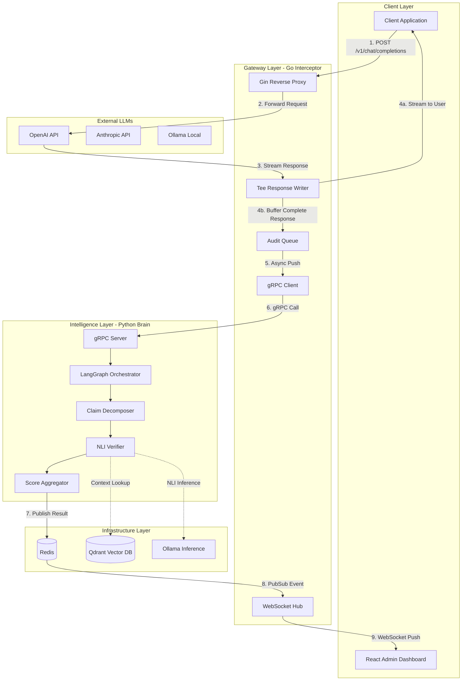
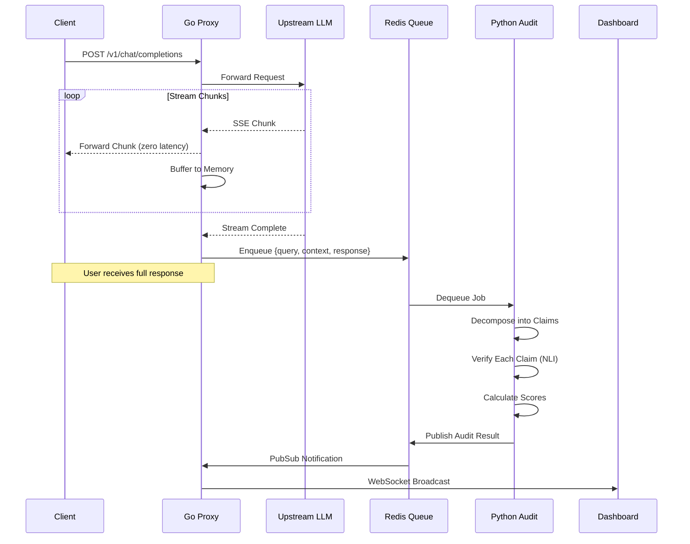
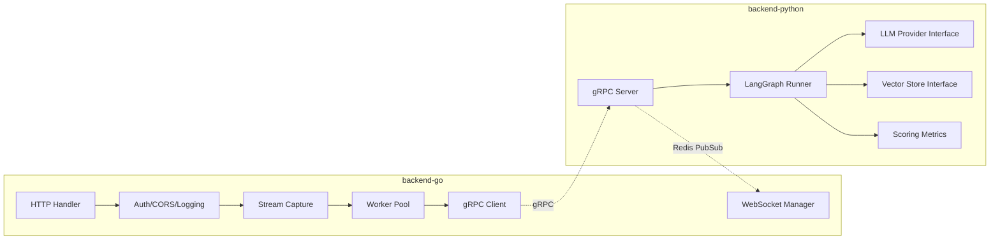
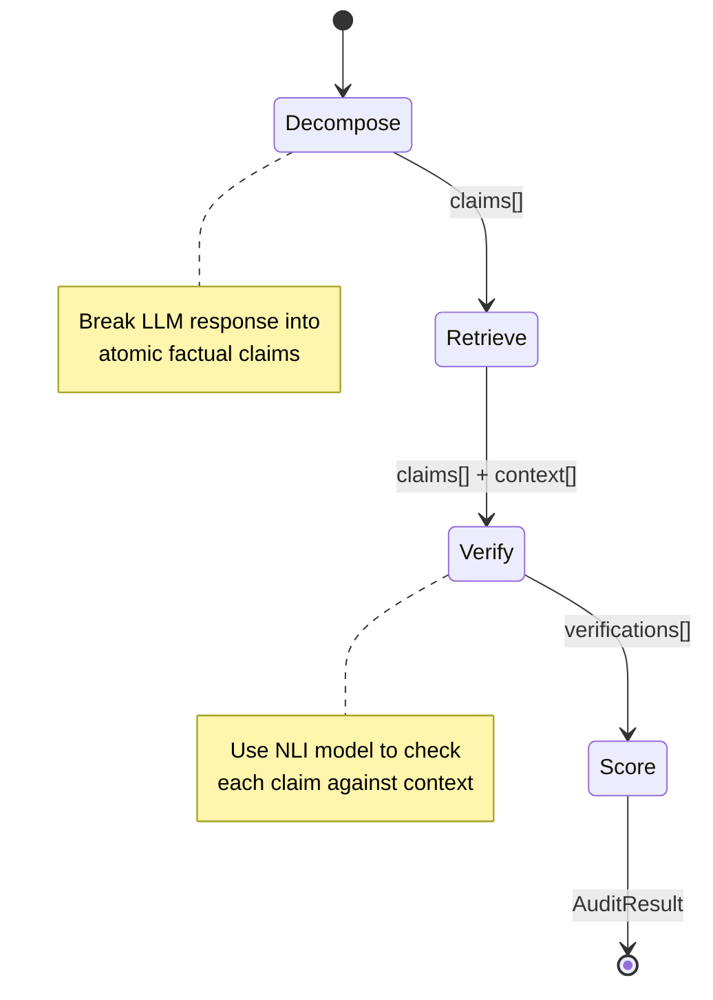

# 🏛️ TruthTable AI Control Plane - Project Architecture Blueprint

> **Generated:** January 31, 2026  
> **Project Type:** Go + Python + React Polyglot  
> **Architecture Pattern:** Microservices  
> **Detail Level:** Implementation-Ready

---

## Table of Contents

1. [Executive Summary](#1-executive-summary)
2. [Architectural Overview](#2-architectural-overview)
3. [Architecture Visualization](#3-architecture-visualization)
4. [Core Architectural Components](#4-core-architectural-components)
5. [Architectural Layers and Dependencies](#5-architectural-layers-and-dependencies)
6. [Data Architecture](#6-data-architecture)
7. [Cross-Cutting Concerns](#7-cross-cutting-concerns)
8. [Service Communication Patterns](#8-service-communication-patterns)
9. [Technology-Specific Patterns](#9-technology-specific-patterns)
10. [Implementation Patterns](#10-implementation-patterns)
11. [Testing Architecture](#11-testing-architecture)
12. [Deployment Architecture](#12-deployment-architecture)
13. [Extension and Evolution Patterns](#13-extension-and-evolution-patterns)
14. [Architectural Pattern Examples](#14-architectural-pattern-examples)
15. [Architectural Decision Records](#15-architectural-decision-records)
16. [Architecture Governance](#16-architecture-governance)
17. [Blueprint for New Development](#17-blueprint-for-new-development)

---

## 1. Executive Summary

### Project Name
**TruthTable** - AI Observability & Hallucination Control Plane

### Core Value Proposition
A high-performance "man-in-the-middle" proxy that intercepts RAG (Retrieval-Augmented Generation) traffic. It acts as a real-time auditor, ensuring that the answers generated by an LLM are factually supported by the retrieved context, preventing "silent failures" in enterprise AI applications.

### Architectural Philosophy

| Principle | Implementation |
|-----------|----------------|
| **Performance First** | Go handles the critical path (User ↔ LLM) with near-zero latency penalty |
| **Modularity** | All LLM providers and Vector DBs are swappable adapters via interfaces |
| **Cost-Efficiency** | Local/free models (Ollama/Llama 3) for development, production models via config |
| **Fail-Open** | Audit failures never block user requests |

---

## 2. Architectural Overview

### Guiding Principles

1. **Zero-Latency Proxying**: The Go interceptor streams responses directly to users while asynchronously capturing for audit
2. **Async Verification**: Python brain performs fact-checking without blocking the response path
3. **Real-Time Observability**: WebSocket broadcast enables live dashboard updates
4. **Plugin Architecture**: Registry patterns for LLM providers, vector stores, and scoring metrics

### Architectural Boundaries

```
┌─────────────────────────────────────────────────────────────────────────────┐
│                           PRESENTATION LAYER                                 │
│  ┌─────────────────────────────────────────────────────────────────────┐    │
│  │                    React Dashboard (frontend-react)                  │    │
│  │         WebSocket Client | REST API Client | UI Components           │    │
│  └─────────────────────────────────────────────────────────────────────┘    │
└─────────────────────────────────────────────────────────────────────────────┘
                                      │
                                      │ HTTP/WebSocket
                                      ▼
┌─────────────────────────────────────────────────────────────────────────────┐
│                            GATEWAY LAYER                                     │
│  ┌─────────────────────────────────────────────────────────────────────┐    │
│  │                   Go Interceptor (backend-go)                        │    │
│  │      Reverse Proxy | Stream Capture | gRPC Client | WS Hub           │    │
│  └─────────────────────────────────────────────────────────────────────┘    │
└─────────────────────────────────────────────────────────────────────────────┘
                                      │
                                      │ gRPC (async)
                                      ▼
┌─────────────────────────────────────────────────────────────────────────────┐
│                           INTELLIGENCE LAYER                                 │
│  ┌─────────────────────────────────────────────────────────────────────┐    │
│  │                  Python Audit Engine (backend-python)                │    │
│  │       LangGraph Orchestration | NLI Verification | Scoring           │    │
│  └─────────────────────────────────────────────────────────────────────┘    │
└─────────────────────────────────────────────────────────────────────────────┘
                                      │
                                      │ Vector Search / LLM Inference
                                      ▼
┌─────────────────────────────────────────────────────────────────────────────┐
│                          INFRASTRUCTURE LAYER                                │
│  ┌──────────────┐  ┌──────────────┐  ┌──────────────┐  ┌──────────────┐     │
│  │    Redis     │  │    Qdrant    │  │    Ollama    │  │  Prometheus  │     │
│  │  Queue/Cache │  │ Vector Store │  │  Local LLM   │  │   Metrics    │     │
│  └──────────────┘  └──────────────┘  └──────────────┘  └──────────────┘     │
└─────────────────────────────────────────────────────────────────────────────┘
```

---

## 3. Architecture Visualization

### 3.1 High-Level System Flow



### 3.2 Request Lifecycle Sequence



### 3.3 Component Interaction Diagram



---

## 4. Core Architectural Components

### 4.1 Go Interceptor Service (backend-go)

#### Purpose and Responsibility
- **Primary Function**: High-performance reverse proxy for LLM API traffic
- **Business Domain**: Request interception, response streaming, async audit dispatch
- **Boundaries**: HTTP handling, stream management, gRPC client communication

#### Internal Structure

```
backend-go/
├── cmd/
│   └── proxy/
│       └── main.go                 # Application entrypoint
├── internal/
│   ├── config/
│   │   └── config.go               # Viper-based configuration
│   ├── proxy/
│   │   ├── handler.go              # Gin HTTP handlers
│   │   ├── middleware.go           # Auth, logging, CORS middleware
│   │   ├── stream.go               # SSE/streaming response handling
│   │   └── tee_writer.go           # Zero-copy response capture
│   ├── grpc/
│   │   ├── client.go               # gRPC client to Python audit engine
│   │   └── interceptors.go         # gRPC interceptors (retry, logging)
│   ├── websocket/
│   │   ├── hub.go                  # WebSocket connection manager
│   │   └── client.go               # Individual WS client handler
│   ├── buffer/
│   │   ├── capture.go              # Response capture buffer
│   │   └── queue.go                # Redis-backed async queue
│   └── metrics/
│       └── prometheus.go           # Metrics exposition
├── pkg/
│   ├── llmprovider/
│   │   ├── provider.go             # LLMProvider interface
│   │   ├── openai.go               # OpenAI implementation
│   │   ├── anthropic.go            # Anthropic implementation
│   │   ├── ollama.go               # Ollama implementation
│   │   └── registry.go             # Provider registry
│   └── models/
│       └── request.go              # Shared request/response types
├── api/
│   └── proto/
│       └── evaluator.proto         # Protobuf definitions
├── go.mod
├── go.sum
└── Dockerfile
```

#### Key Design Patterns

| Pattern | Usage |
|---------|-------|
| **Reverse Proxy** | `httputil.ReverseProxy` for transparent forwarding |
| **Tee Writer** | `io.MultiWriter` for simultaneous stream + capture |
| **Worker Pool** | Goroutine pool with buffered channels for async dispatch |
| **Hub Pattern** | Central WebSocket manager for broadcast |
| **Registry Pattern** | Dynamic LLM provider selection |

#### Interaction Patterns

```go
// Simplified flow
func (h *Handler) HandleCompletion(c *gin.Context) {
    // 1. Parse request
    req := parseOpenAIRequest(c)
    
    // 2. Create tee writer
    tee := NewTeeResponseWriter(c.Writer)
    
    // 3. Proxy to upstream (streams directly to client)
    h.proxy.ServeHTTP(tee, c.Request)
    
    // 4. Async dispatch captured response
    h.auditQueue <- AuditPayload{
        Query:    req.Messages[len(req.Messages)-1].Content,
        Context:  extractContext(req),
        Response: tee.CapturedBody(),
    }
}
```

---

### 4.2 Python Audit Engine (backend-python)

#### Purpose and Responsibility
- **Primary Function**: Intelligent fact-checking and hallucination detection
- **Business Domain**: Claim decomposition, NLI verification, scoring
- **Boundaries**: gRPC server, LangGraph orchestration, LLM/VectorDB abstraction

#### Internal Structure

```
backend-python/
├── src/
│   └── truthtable/
│       ├── __init__.py
│       ├── main.py                 # gRPC server entrypoint
│       ├── config.py               # Pydantic settings
│       ├── grpc/
│       │   ├── __init__.py
│       │   ├── server.py           # gRPC servicer implementation
│       │   └── pb/                 # Generated protobuf code
│       ├── graphs/
│       │   ├── __init__.py
│       │   ├── audit_graph.py      # Main LangGraph orchestration
│       │   ├── nodes/
│       │   │   ├── __init__.py
│       │   │   ├── decomposer.py   # Claim decomposition node
│       │   │   ├── retriever.py    # Context retrieval node
│       │   │   ├── verifier.py     # NLI verification node
│       │   │   └── scorer.py       # Scoring aggregation node
│       │   └── state.py            # Graph state definitions
│       ├── providers/
│       │   ├── __init__.py
│       │   ├── base.py             # LLMProvider abstract base
│       │   ├── ollama.py           # Ollama provider
│       │   ├── openai.py           # OpenAI provider
│       │   └── registry.py         # Provider registry
│       ├── vectorstore/
│       │   ├── __init__.py
│       │   ├── base.py             # VectorStore abstract base
│       │   ├── qdrant.py           # Qdrant implementation
│       │   └── factory.py          # VectorStore factory
│       └── scoring/
│           ├── __init__.py
│           ├── metrics.py          # Scoring metric definitions
│           └── aggregator.py       # Score aggregation logic
├── tests/
│   ├── unit/
│   ├── integration/
│   └── fixtures/
├── pyproject.toml
└── Dockerfile
```

#### LangGraph Workflow



#### State Schema

```python
from typing import TypedDict, List

class ClaimVerification(TypedDict):
    claim: str
    supported: bool
    confidence: float
    evidence: List[str]

class AuditState(TypedDict):
    # Input
    request_id: str
    user_query: str
    llm_response: str
    context_docs: List[str]
    
    # Intermediate
    claims: List[str]
    verifications: List[ClaimVerification]
    
    # Output
    overall_score: float
    hallucination_detected: bool
    reasoning_trace: str
```

---

### 4.3 React Dashboard (frontend-react)

#### Purpose and Responsibility
- **Primary Function**: Real-time observability and audit visualization
- **Business Domain**: Trust score monitoring, hallucination highlighting
- **Boundaries**: WebSocket consumption, REST API calls, UI rendering

#### Internal Structure

```
frontend-react/
├── src/
│   ├── main.tsx
│   ├── App.tsx
│   ├── components/
│   │   ├── ui/                     # Reusable UI primitives
│   │   │   ├── Button.tsx
│   │   │   ├── Card.tsx
│   │   │   ├── Badge.tsx
│   │   │   └── Gauge.tsx
│   │   ├── layout/
│   │   │   ├── Header.tsx
│   │   │   ├── Sidebar.tsx
│   │   │   └── MainLayout.tsx
│   │   ├── dashboard/
│   │   │   ├── MetricsPanel.tsx
│   │   │   ├── TrustScoreGauge.tsx
│   │   │   └── RequestTimeline.tsx
│   │   ├── audit/
│   │   │   ├── AuditFeed.tsx       # Real-time audit stream
│   │   │   ├── AuditDetail.tsx     # Expanded view
│   │   │   ├── ClaimBreakdown.tsx
│   │   │   └── EvidencePanel.tsx
│   │   └── charts/
│   │       ├── AccuracyTrend.tsx
│   │       └── ProviderComparison.tsx
│   ├── hooks/
│   │   ├── useWebSocket.ts         # WebSocket connection hook
│   │   ├── useAuditStream.ts       # Audit event stream hook
│   │   └── useMetrics.ts           # Metrics polling hook
│   ├── stores/
│   │   ├── auditStore.ts           # Zustand audit state
│   │   └── settingsStore.ts        # User preferences
│   ├── services/
│   │   ├── api.ts                  # REST API client
│   │   └── websocket.ts            # WebSocket manager
│   ├── types/
│   │   ├── audit.ts
│   │   └── metrics.ts
│   └── styles/
│       └── cyberpunk.css           # Dark mode theme
├── tailwind.config.js
├── vite.config.ts
└── package.json
```

#### Component Hierarchy

```
App
├── MainLayout
│   ├── Header
│   │   ├── Logo
│   │   ├── ConnectionStatus
│   │   └── SettingsDropdown
│   ├── Sidebar
│   │   ├── NavLinks
│   │   └── QuickStats
│   └── MainContent
│       ├── MetricsPanel
│       │   ├── TrustScoreGauge
│       │   ├── RequestCount
│       │   └── HallucinationRate
│       ├── AuditFeed
│       │   └── AuditRow (repeating)
│       │       ├── QueryPreview
│       │       ├── TrustBadge
│       │       └── ExpandButton
│       └── AuditDetail (modal/drawer)
│           ├── FullQuery
│           ├── ClaimBreakdown
│           │   └── ClaimRow (repeating)
│           │       ├── ClaimText
│           │       ├── VerificationBadge
│           │       └── EvidenceList
│           └── ReasoningTrace
└── ChartsPanel
    ├── AccuracyTrend
    └── ProviderComparison
```

---

## 5. Architectural Layers and Dependencies

### Layer Dependency Rules

```
┌─────────────────────────────────────────────────────────────────┐
│                     PRESENTATION LAYER                          │
│  • React components may only import from hooks, stores, types   │
│  • No direct API calls in components (use hooks)                │
│  • No business logic in components (use stores)                 │
└─────────────────────────────────────────────────────────────────┘
                              │ depends on
                              ▼
┌─────────────────────────────────────────────────────────────────┐
│                      APPLICATION LAYER                          │
│  • Go handlers orchestrate but don't contain business logic    │
│  • Python gRPC server delegates to LangGraph                   │
│  • Handlers may import from internal packages only              │
└─────────────────────────────────────────────────────────────────┘
                              │ depends on
                              ▼
┌─────────────────────────────────────────────────────────────────┐
│                       DOMAIN LAYER                              │
│  • LangGraph nodes contain pure business logic                 │
│  • Scoring metrics are domain concepts                         │
│  • No framework dependencies in domain code                     │
└─────────────────────────────────────────────────────────────────┘
                              │ depends on
                              ▼
┌─────────────────────────────────────────────────────────────────┐
│                    INFRASTRUCTURE LAYER                         │
│  • Implements interfaces defined in domain layer               │
│  • Contains all external service integrations                  │
│  • Providers, repositories, external clients                    │
└─────────────────────────────────────────────────────────────────┘
```

### Dependency Injection Patterns

#### Go (Wire-style manual DI)

```go
// cmd/proxy/main.go
func main() {
    // Load config
    cfg := config.Load()
    
    // Build dependencies bottom-up
    redisClient := redis.NewClient(cfg.Redis)
    grpcClient := grpc.NewAuditClient(cfg.GRPC)
    wsHub := websocket.NewHub()
    auditQueue := buffer.NewQueue(redisClient)
    
    // Inject into handlers
    handler := proxy.NewHandler(
        proxy.WithGRPCClient(grpcClient),
        proxy.WithAuditQueue(auditQueue),
        proxy.WithWSHub(wsHub),
    )
    
    // Start servers
    go wsHub.Run()
    gin.Default().POST("/v1/chat/completions", handler.Handle)
}
```

#### Python (Dependency Injection with Factory)

```python
# src/truthtable/main.py
from truthtable.config import get_settings
from truthtable.providers.registry import get_provider
from truthtable.vectorstore.factory import get_vectorstore
from truthtable.graphs.audit_graph import build_audit_graph

def create_app():
    settings = get_settings()
    
    # Build dependencies
    llm_provider = get_provider(settings.llm_backend)
    vector_store = get_vectorstore(settings.vector_backend)
    
    # Inject into graph
    audit_graph = build_audit_graph(
        llm=llm_provider,
        vectorstore=vector_store,
    )
    
    # Create gRPC server with injected graph
    return GRPCServer(audit_graph)
```

---

## 6. Data Architecture

### 6.1 Domain Models

#### Audit Request (Input)

```protobuf
message AuditRequest {
    string request_id = 1;          // UUID for tracing
    string user_query = 2;          // Original user question
    string llm_response = 3;        // Generated answer to verify
    repeated ContextDocument context = 4;  // RAG retrieved chunks
    string provider = 5;            // Which LLM generated this
    string model = 6;               // Specific model name
    int64 timestamp_ms = 7;         // Request timestamp
    map<string, string> metadata = 8;  // Additional context
}

message ContextDocument {
    string id = 1;
    string content = 2;
    string source = 3;              // Document origin
    float relevance_score = 4;      // RAG retrieval score
}
```

#### Audit Result (Output)

```protobuf
message AuditResult {
    string audit_id = 1;
    string request_id = 2;          // Links to original request
    
    // Scores
    float faithfulness_score = 3;   // 0.0 - 1.0
    float relevancy_score = 4;      // 0.0 - 1.0
    float overall_score = 5;        // Weighted combination
    
    // Findings
    bool hallucination_detected = 6;
    repeated ClaimVerification claims = 7;
    
    // Diagnostics
    string reasoning_trace = 8;     // Explanation of findings
    int64 processing_time_ms = 9;
}

message ClaimVerification {
    string claim = 1;               // Atomic statement
    VerificationStatus status = 2;  // SUPPORTED, UNSUPPORTED, UNKNOWN
    float confidence = 3;           // Model confidence
    repeated string evidence = 4;   // Supporting context snippets
}

enum VerificationStatus {
    UNKNOWN = 0;
    SUPPORTED = 1;
    UNSUPPORTED = 2;
    PARTIALLY_SUPPORTED = 3;
}
```

### 6.2 Data Flow

```mermaid
flowchart LR
    subgraph "Ingress"
        A[Client Request] --> B[Parse JSON]
        B --> C[Extract Query + Context]
    end
    
    subgraph "Processing"
        C --> D[Forward to LLM]
        D --> E[Stream Response]
        E --> F[Buffer Complete Text]
    end
    
    subgraph "Audit Pipeline"
        F --> G[gRPC AuditRequest]
        G --> H[Decompose Claims]
        H --> I[Vector Search]
        I --> J[NLI Verification]
        J --> K[Score Aggregation]
    end
    
    subgraph "Output"
        K --> L[AuditResult Proto]
        L --> M[Redis PubSub]
        M --> N[WebSocket Broadcast]
        N --> O[Dashboard Update]
    end
```



### 6.3 Caching Strategy

| Data Type | Cache Location | TTL | Eviction |
|-----------|----------------|-----|----------|
| Audit Results | Redis | 24h | LRU |
| Duplicate Query Detection | Redis | 1h | Exact match |
| Vector Embeddings | Qdrant | Permanent | Manual |
| LLM Response Cache | Redis | 4h | Query hash |

### 6.4 Data Validation Patterns

```python
# Input validation with Pydantic
from pydantic import BaseModel, Field, validator

class AuditRequestModel(BaseModel):
    request_id: str = Field(..., min_length=36, max_length=36)
    user_query: str = Field(..., min_length=1, max_length=10000)
    llm_response: str = Field(..., min_length=1)
    context: list[ContextDocument] = Field(..., min_items=0, max_items=100)
    
    @validator('request_id')
    def validate_uuid(cls, v):
        try:
            uuid.UUID(v)
        except ValueError:
            raise ValueError('Invalid UUID format')
        return v
```

---

## 7. Cross-Cutting Concerns

### 7.1 Error Handling & Resilience

#### Go Proxy - Fail-Open Pattern

```go
// The proxy NEVER blocks user requests due to audit failures
func (h *Handler) dispatchAudit(payload AuditPayload) {
    select {
    case h.auditQueue <- payload:
        // Successfully queued
    default:
        // Queue full - log and continue (fail-open)
        h.logger.Warn("audit queue full, dropping audit",
            zap.String("request_id", payload.RequestID))
        h.metrics.DroppedAudits.Inc()
    }
}

// gRPC client with retry and circuit breaker
func (c *AuditClient) Submit(ctx context.Context, req *pb.AuditRequest) error {
    // Retry with exponential backoff
    return retry.Do(func() error {
        return c.client.AuditRAG(ctx, req)
    },
        retry.Attempts(3),
        retry.Delay(100*time.Millisecond),
        retry.MaxDelay(2*time.Second),
    )
}
```

#### Python Engine - Graceful Degradation

```python
async def verify_claim(claim: str, context: list[str]) -> ClaimVerification:
    try:
        result = await nli_model.entailment(claim, context)
        return ClaimVerification(
            claim=claim,
            status=result.label,
            confidence=result.score,
            evidence=result.evidence,
        )
    except ModelTimeoutError:
        # Degrade gracefully - mark as unknown
        return ClaimVerification(
            claim=claim,
            status=VerificationStatus.UNKNOWN,
            confidence=0.0,
            evidence=[],
        )
    except Exception as e:
        logger.error("Verification failed", claim=claim, error=str(e))
        raise AuditError(f"Verification failed: {e}")
```

### 7.2 Logging & Observability

#### Structured Logging Format

```json
{
  "timestamp": "2026-01-31T10:30:00Z",
  "level": "info",
  "service": "truthtable-proxy",
  "request_id": "550e8400-e29b-41d4-a716-446655440000",
  "audit_id": "660e8400-e29b-41d4-a716-446655440001",
  "event": "audit_completed",
  "duration_ms": 450,
  "score": 0.85,
  "hallucinations": 1,
  "claims_total": 5
}
```

#### Metrics Exposition

| Metric | Type | Labels | Description |
|--------|------|--------|-------------|
| `truthtable_requests_total` | Counter | provider, model | Total proxied requests |
| `truthtable_latency_seconds` | Histogram | provider, phase | Latency by phase |
| `truthtable_audits_total` | Counter | status | Completed audits |
| `truthtable_faithfulness_score` | Histogram | provider | Score distribution |
| `truthtable_hallucinations_total` | Counter | provider, severity | Detected hallucinations |
| `truthtable_queue_depth` | Gauge | queue_name | Current queue size |

#### Distributed Tracing

```go
// Trace context propagation
func (h *Handler) Handle(c *gin.Context) {
    ctx, span := tracer.Start(c.Request.Context(), "proxy.handle")
    defer span.End()
    
    span.SetAttributes(
        attribute.String("request_id", requestID),
        attribute.String("provider", provider),
    )
    
    // Propagate to gRPC
    ctx = metadata.AppendToOutgoingContext(ctx,
        "x-trace-id", span.SpanContext().TraceID().String(),
    )
}
```

### 7.3 Configuration Management

#### Environment-Based Configuration

```yaml
# config/config.yaml (base)
server:
  port: 8080
  read_timeout: 30s
  write_timeout: 60s

redis:
  url: redis://localhost:6379
  pool_size: 10

grpc:
  audit_address: localhost:50051
  timeout: 30s

---
# config/config.production.yaml (overlay)
server:
  port: ${PORT:8080}

redis:
  url: ${REDIS_URL}
  
grpc:
  audit_address: ${AUDIT_SERVICE_URL}
```

#### Secret Management

```python
# Secrets loaded from environment, never hardcoded
class Settings(BaseSettings):
    # Sensitive - loaded from env only
    openai_api_key: SecretStr = Field(..., env="OPENAI_API_KEY")
    anthropic_api_key: SecretStr = Field(..., env="ANTHROPIC_API_KEY")
    
    # Non-sensitive - can have defaults
    ollama_base_url: str = "http://localhost:11434"
    
    class Config:
        env_file = ".env"
        env_file_encoding = "utf-8"
        secrets_dir = "/run/secrets"  # Docker secrets support
```

### 7.4 Authentication & Authorization

```go
// API Key middleware for proxy
func APIKeyAuth(validKeys []string) gin.HandlerFunc {
    keySet := make(map[string]bool)
    for _, k := range validKeys {
        keySet[k] = true
    }
    
    return func(c *gin.Context) {
        key := c.GetHeader("X-API-Key")
        if key == "" {
            key = c.GetHeader("Authorization")
            key = strings.TrimPrefix(key, "Bearer ")
        }
        
        if !keySet[key] {
            c.AbortWithStatusJSON(401, gin.H{
                "error": "Invalid API key",
            })
            return
        }
        
        c.Next()
    }
}
```

---

## 8. Service Communication Patterns

### 8.1 Protocol Definitions

| Communication | Protocol | Format | Use Case |
|--------------|----------|--------|----------|
| Client → Proxy | HTTP/1.1 | JSON (OpenAI format) | LLM requests |
| Proxy → Upstream LLM | HTTP/1.1 SSE | JSON streaming | Response forwarding |
| Proxy → Audit Engine | gRPC | Protocol Buffers | Async audit dispatch |
| Audit Engine → Proxy | Redis PubSub | JSON | Result notifications |
| Proxy → Dashboard | WebSocket | JSON | Real-time updates |

### 8.2 gRPC Service Definition

```protobuf
syntax = "proto3";

package truthtable.audit.v1;

option go_package = "github.com/truthtable/backend-go/api/audit/v1";

service AuditService {
    // Async audit - fire and forget, results via Redis PubSub
    rpc SubmitAudit(AuditRequest) returns (AuditSubmission);
    
    // Sync audit - blocks until complete (testing/debugging)
    rpc AuditSync(AuditRequest) returns (AuditResult);
    
    // Health check
    rpc HealthCheck(HealthRequest) returns (HealthResponse);
}

message AuditSubmission {
    string audit_id = 1;
    string status = 2;  // "queued", "processing"
    int32 queue_position = 3;
}

message HealthRequest {}

message HealthResponse {
    bool healthy = 1;
    string version = 2;
    map<string, bool> dependencies = 3;
}
```

### 8.3 WebSocket Message Protocol

```typescript
// Client → Server
interface WSClientMessage {
    type: "subscribe" | "unsubscribe" | "ping";
    channel?: string;  // "audits", "metrics", "alerts"
}

// Server → Client
interface WSServerMessage {
    type: "audit_result" | "metric_update" | "error" | "pong";
    timestamp: string;
    data: AuditResult | MetricUpdate | ErrorPayload;
}

interface AuditResult {
    audit_id: string;
    request_id: string;
    overall_score: number;
    hallucination_detected: boolean;
    claims: ClaimVerification[];
    processing_time_ms: number;
}
```

### 8.4 Resilience Patterns

```go
// Circuit breaker for gRPC calls
var cb = gobreaker.NewCircuitBreaker(gobreaker.Settings{
    Name:        "audit-service",
    MaxRequests: 5,
    Interval:    10 * time.Second,
    Timeout:     30 * time.Second,
    ReadyToTrip: func(counts gobreaker.Counts) bool {
        return counts.ConsecutiveFailures > 3
    },
    OnStateChange: func(name string, from, to gobreaker.State) {
        log.Info("circuit breaker state change",
            zap.String("name", name),
            zap.String("from", from.String()),
            zap.String("to", to.String()),
        )
    },
})

func (c *Client) SubmitAudit(ctx context.Context, req *pb.AuditRequest) error {
    _, err := cb.Execute(func() (interface{}, error) {
        return nil, c.client.SubmitAudit(ctx, req)
    })
    return err
}
```

---

## 9. Technology-Specific Patterns

### 9.1 Go Architectural Patterns

#### Gin Middleware Pipeline

```go
func SetupRouter(cfg *config.Config) *gin.Engine {
    r := gin.New()
    
    // Middleware stack (order matters)
    r.Use(
        gin.Recovery(),                    // Panic recovery
        middleware.RequestID(),            // UUID injection
        middleware.Logger(cfg.Logger),     // Structured logging
        middleware.Metrics(),              // Prometheus metrics
        middleware.CORS(cfg.CORS),         // CORS headers
        middleware.RateLimit(cfg.RateLimit), // Rate limiting
    )
    
    // Routes
    v1 := r.Group("/v1")
    {
        v1.POST("/chat/completions", handler.HandleCompletion)
        v1.GET("/health", handler.HealthCheck)
    }
    
    // WebSocket (separate from REST)
    r.GET("/ws", wsHandler.HandleWebSocket)
    
    return r
}
```

#### Goroutine Worker Pool

```go
type WorkerPool struct {
    jobs    chan AuditPayload
    results chan AuditResult
    workers int
    wg      sync.WaitGroup
}

func NewWorkerPool(size int) *WorkerPool {
    return &WorkerPool{
        jobs:    make(chan AuditPayload, size*10),
        results: make(chan AuditResult, size*10),
        workers: size,
    }
}

func (p *WorkerPool) Start(client *AuditClient) {
    for i := 0; i < p.workers; i++ {
        p.wg.Add(1)
        go func(id int) {
            defer p.wg.Done()
            for job := range p.jobs {
                result, err := client.Submit(context.Background(), job)
                if err != nil {
                    log.Error("audit failed", zap.Error(err))
                    continue
                }
                p.results <- result
            }
        }(i)
    }
}
```

### 9.2 Python Architectural Patterns

#### LangGraph State Machine

```python
from langgraph.graph import StateGraph, END
from typing import Annotated
from operator import add

class AuditState(TypedDict):
    request_id: str
    user_query: str
    llm_response: str
    context_docs: list[str]
    claims: Annotated[list[str], add]  # Accumulator
    verifications: Annotated[list[ClaimVerification], add]
    overall_score: float
    hallucination_detected: bool

def build_audit_graph() -> StateGraph:
    workflow = StateGraph(AuditState)
    
    # Add nodes
    workflow.add_node("decompose", decompose_into_claims)
    workflow.add_node("retrieve", retrieve_additional_context)
    workflow.add_node("verify", verify_claims)
    workflow.add_node("score", calculate_scores)
    
    # Define edges
    workflow.set_entry_point("decompose")
    workflow.add_edge("decompose", "retrieve")
    workflow.add_edge("retrieve", "verify")
    workflow.add_edge("verify", "score")
    workflow.add_edge("score", END)
    
    return workflow.compile()
```

#### Abstract Base Class Pattern

```python
from abc import ABC, abstractmethod
from typing import AsyncIterator

class LLMProvider(ABC):
    """Abstract base for all LLM integrations."""
    
    @property
    @abstractmethod
    def name(self) -> str:
        """Provider identifier."""
        pass
    
    @abstractmethod
    async def complete(
        self, 
        prompt: str, 
        system: str | None = None,
        **kwargs
    ) -> str:
        """Generate completion."""
        pass
    
    @abstractmethod
    async def stream(
        self, 
        prompt: str,
        system: str | None = None,
        **kwargs
    ) -> AsyncIterator[str]:
        """Stream completion chunks."""
        pass
    
    async def health_check(self) -> bool:
        """Check if provider is available."""
        try:
            await self.complete("test", max_tokens=1)
            return True
        except Exception:
            return False
```

### 9.3 React Architectural Patterns

#### Custom Hooks Pattern

```typescript
// hooks/useWebSocket.ts
export function useWebSocket(url: string) {
    const [isConnected, setIsConnected] = useState(false);
    const [lastMessage, setLastMessage] = useState<WSServerMessage | null>(null);
    const wsRef = useRef<WebSocket | null>(null);
    
    useEffect(() => {
        const ws = new WebSocket(url);
        
        ws.onopen = () => setIsConnected(true);
        ws.onclose = () => setIsConnected(false);
        ws.onmessage = (event) => {
            setLastMessage(JSON.parse(event.data));
        };
        
        wsRef.current = ws;
        
        return () => ws.close();
    }, [url]);
    
    const send = useCallback((message: WSClientMessage) => {
        wsRef.current?.send(JSON.stringify(message));
    }, []);
    
    return { isConnected, lastMessage, send };
}
```

#### Zustand State Management

```typescript
// stores/auditStore.ts
import { create } from 'zustand';

interface AuditState {
    audits: AuditResult[];
    selectedAudit: AuditResult | null;
    
    // Actions
    addAudit: (audit: AuditResult) => void;
    selectAudit: (id: string) => void;
    clearAudits: () => void;
}

export const useAuditStore = create<AuditState>((set) => ({
    audits: [],
    selectedAudit: null,
    
    addAudit: (audit) => set((state) => ({
        audits: [audit, ...state.audits].slice(0, 100), // Keep last 100
    })),
    
    selectAudit: (id) => set((state) => ({
        selectedAudit: state.audits.find(a => a.audit_id === id) || null,
    })),
    
    clearAudits: () => set({ audits: [], selectedAudit: null }),
}));
```

---

## 10. Implementation Patterns

### 10.1 Interface Design Patterns

#### Go Provider Interface

```go
// pkg/llmprovider/provider.go
package llmprovider

type LLMProvider interface {
    Name() string
    Complete(ctx context.Context, req *CompletionRequest) (*CompletionResponse, error)
    StreamComplete(ctx context.Context, req *CompletionRequest) (<-chan StreamChunk, <-chan error)
    HealthCheck(ctx context.Context) error
}

// Registry for dynamic provider selection
type ProviderRegistry interface {
    Register(provider LLMProvider)
    Get(name string) (LLMProvider, bool)
    List() []string
    Default() LLMProvider
}
```

#### Python VectorStore Interface

```python
# vectorstore/base.py
from abc import ABC, abstractmethod
from typing import Protocol

class VectorStore(Protocol):
    """Protocol for vector store implementations."""
    
    async def upsert(self, documents: list[Document]) -> None: ...
    async def search(
        self, 
        query_embedding: list[float], 
        top_k: int = 5,
        filter: dict | None = None
    ) -> list[SearchResult]: ...
    async def delete(self, ids: list[str]) -> None: ...
```

### 10.2 Service Implementation Templates

#### Go Service Template

```go
// internal/proxy/handler.go
package proxy

type Handler struct {
    upstream    *httputil.ReverseProxy
    grpcClient  *grpc.AuditClient
    auditQueue  chan<- AuditPayload
    wsHub       *websocket.Hub
    logger      *zap.Logger
    metrics     *Metrics
}

type HandlerOption func(*Handler)

func WithGRPCClient(client *grpc.AuditClient) HandlerOption {
    return func(h *Handler) { h.grpcClient = client }
}

func NewHandler(opts ...HandlerOption) *Handler {
    h := &Handler{
        logger:  zap.NewNop(),
        metrics: NewMetrics(),
    }
    for _, opt := range opts {
        opt(h)
    }
    return h
}

func (h *Handler) Handle(c *gin.Context) {
    // Implementation
}
```

#### Python Service Template

```python
# graphs/nodes/verifier.py
from truthtable.providers.base import LLMProvider
from truthtable.scoring.metrics import ClaimVerification

class VerifierNode:
    """Verifies claims against context using NLI."""
    
    def __init__(
        self, 
        llm: LLMProvider,
        confidence_threshold: float = 0.7
    ):
        self.llm = llm
        self.threshold = confidence_threshold
    
    async def __call__(self, state: AuditState) -> dict:
        verifications = []
        
        for claim in state["claims"]:
            result = await self._verify_single(claim, state["context_docs"])
            verifications.append(result)
        
        return {"verifications": verifications}
    
    async def _verify_single(
        self, 
        claim: str, 
        context: list[str]
    ) -> ClaimVerification:
        prompt = self._build_prompt(claim, context)
        response = await self.llm.complete(prompt, system=NLI_SYSTEM_PROMPT)
        return self._parse_response(claim, response)
```

### 10.3 Error Handling Patterns

```go
// pkg/errors/errors.go
package errors

type ErrorCode string

const (
    ErrUpstreamTimeout    ErrorCode = "UPSTREAM_TIMEOUT"
    ErrUpstreamBadGateway ErrorCode = "UPSTREAM_BAD_GATEWAY"
    ErrAuditFailed        ErrorCode = "AUDIT_FAILED"
    ErrInvalidRequest     ErrorCode = "INVALID_REQUEST"
    ErrRateLimited        ErrorCode = "RATE_LIMITED"
)

type TruthTableError struct {
    Code    ErrorCode         `json:"code"`
    Message string            `json:"message"`
    Details map[string]string `json:"details,omitempty"`
    Cause   error             `json:"-"`
}

func (e *TruthTableError) Error() string {
    return fmt.Sprintf("[%s] %s", e.Code, e.Message)
}

func (e *TruthTableError) Unwrap() error {
    return e.Cause
}

// Constructors
func UpstreamTimeout(cause error) *TruthTableError {
    return &TruthTableError{
        Code:    ErrUpstreamTimeout,
        Message: "Upstream LLM request timed out",
        Cause:   cause,
    }
}
```

---

## 11. Testing Architecture

### 11.1 Test Pyramid

```
                    ┌─────────────┐
                    │   E2E Tests │  ← Docker Compose full stack
                    │   (10%)     │
                    ├─────────────┤
                    │ Integration │  ← Testcontainers (Redis, Qdrant)
                    │   (20%)     │
                    ├─────────────┤
                    │ Unit Tests  │  ← Mocks/Stubs
                    │   (70%)     │
                    └─────────────┘
```

### 11.2 Go Testing Strategy

```go
// Unit test with mocks
func TestHandler_HandleCompletion(t *testing.T) {
    // Arrange
    mockProvider := mocks.NewMockLLMProvider(t)
    mockProvider.EXPECT().
        Complete(mock.Anything, mock.Anything).
        Return(&CompletionResponse{Content: "test"}, nil)
    
    handler := NewHandler(WithProvider(mockProvider))
    
    // Act
    w := httptest.NewRecorder()
    req := httptest.NewRequest("POST", "/v1/chat/completions", 
        strings.NewReader(`{"model":"gpt-4","messages":[]}`))
    handler.Handle(gin.CreateTestContext(w, req))
    
    // Assert
    assert.Equal(t, 200, w.Code)
}

// Integration test with testcontainers
func TestIntegration_AuditFlow(t *testing.T) {
    if testing.Short() {
        t.Skip("skipping integration test")
    }
    
    ctx := context.Background()
    
    // Start Redis container
    redisC, err := testcontainers.GenericContainer(ctx, 
        testcontainers.GenericContainerRequest{
            ContainerRequest: testcontainers.ContainerRequest{
                Image:        "redis:7-alpine",
                ExposedPorts: []string{"6379/tcp"},
                WaitingFor:   wait.ForLog("Ready to accept connections"),
            },
            Started: true,
        })
    require.NoError(t, err)
    defer redisC.Terminate(ctx)
    
    // Run test against container
    endpoint, _ := redisC.Endpoint(ctx, "")
    // ...
}
```

### 11.3 Python Testing Strategy

```python
# tests/unit/test_decomposer.py
import pytest
from unittest.mock import AsyncMock
from truthtable.graphs.nodes.decomposer import DecomposerNode

@pytest.fixture
def mock_llm():
    llm = AsyncMock()
    llm.complete.return_value = """
    1. Paris is the capital of France.
    2. The Eiffel Tower is 330 meters tall.
    """
    return llm

@pytest.mark.asyncio
async def test_decompose_extracts_claims(mock_llm):
    node = DecomposerNode(llm=mock_llm)
    
    state = {
        "llm_response": "Paris is the capital of France. The Eiffel Tower is 330 meters tall.",
        "claims": [],
    }
    
    result = await node(state)
    
    assert len(result["claims"]) == 2
    assert "Paris" in result["claims"][0]
    mock_llm.complete.assert_called_once()

# tests/integration/test_audit_graph.py
@pytest.mark.integration
async def test_full_audit_pipeline(qdrant_container, ollama_container):
    """Integration test with real containers."""
    graph = build_audit_graph()
    
    result = await graph.ainvoke({
        "user_query": "What is the height of the Eiffel Tower?",
        "llm_response": "The Eiffel Tower is 330 meters tall.",
        "context_docs": ["The Eiffel Tower, built in 1889, stands at 330 meters."],
    })
    
    assert result["overall_score"] > 0.9
    assert not result["hallucination_detected"]
```

### 11.4 Frontend Testing Strategy

```typescript
// src/components/audit/__tests__/AuditFeed.test.tsx
import { render, screen, waitFor } from '@testing-library/react';
import { describe, it, expect, vi } from 'vitest';
import { AuditFeed } from '../AuditFeed';
import { useAuditStore } from '../../../stores/auditStore';

// Mock the store
vi.mock('../../../stores/auditStore');

describe('AuditFeed', () => {
    beforeEach(() => {
        vi.mocked(useAuditStore).mockReturnValue({
            audits: [
                {
                    audit_id: '1',
                    overall_score: 0.95,
                    hallucination_detected: false,
                    claims: [],
                },
            ],
            selectedAudit: null,
            addAudit: vi.fn(),
            selectAudit: vi.fn(),
            clearAudits: vi.fn(),
        });
    });
    
    it('renders audit items', () => {
        render(<AuditFeed />);
        expect(screen.getByText('0.95')).toBeInTheDocument();
    });
    
    it('shows green badge for high scores', () => {
        render(<AuditFeed />);
        const badge = screen.getByTestId('trust-badge');
        expect(badge).toHaveClass('bg-green-500');
    });
});
```

---

## 12. Deployment Architecture

### 12.1 Docker Compose (Development)

```yaml
# docker-compose.yml
version: '3.8'

services:
  go-proxy:
    build:
      context: ./backend-go
      dockerfile: Dockerfile
    ports:
      - "8080:8080"
      - "8081:8081"  # WebSocket
    environment:
      - TRUTHTABLE_SERVER_PORT=8080
      - TRUTHTABLE_REDIS_URL=redis://redis:6379
      - TRUTHTABLE_GRPC_AUDIT_ADDRESS=python-audit:50051
    depends_on:
      redis:
        condition: service_healthy
      python-audit:
        condition: service_healthy
    healthcheck:
      test: ["CMD", "curl", "-f", "http://localhost:8080/health"]
      interval: 10s
      timeout: 5s
      retries: 3

  python-audit:
    build:
      context: ./backend-python
      dockerfile: Dockerfile
    ports:
      - "50051:50051"
    environment:
      - TRUTHTABLE_GRPC_PORT=50051
      - TRUTHTABLE_REDIS_URL=redis://redis:6379
      - TRUTHTABLE_QDRANT_HOST=qdrant
      - TRUTHTABLE_OLLAMA_BASE_URL=http://ollama:11434
    depends_on:
      redis:
        condition: service_healthy
      qdrant:
        condition: service_healthy
      ollama:
        condition: service_started
    healthcheck:
      test: ["CMD", "grpc_health_probe", "-addr=:50051"]
      interval: 10s
      timeout: 5s
      retries: 3

  frontend:
    build:
      context: ./frontend-react
      dockerfile: Dockerfile
      args:
        - VITE_API_URL=http://localhost:8080
        - VITE_WS_URL=ws://localhost:8081
    ports:
      - "3000:80"
    depends_on:
      - go-proxy

  redis:
    image: redis:7-alpine
    ports:
      - "6379:6379"
    volumes:
      - redis_data:/data
    command: redis-server --appendonly yes
    healthcheck:
      test: ["CMD", "redis-cli", "ping"]
      interval: 5s
      timeout: 3s
      retries: 3

  qdrant:
    image: qdrant/qdrant:latest
    ports:
      - "6333:6333"
      - "6334:6334"
    volumes:
      - qdrant_data:/qdrant/storage
    healthcheck:
      test: ["CMD", "curl", "-f", "http://localhost:6333/"]
      interval: 10s
      timeout: 5s
      retries: 3

  ollama:
    image: ollama/ollama:latest
    ports:
      - "11434:11434"
    volumes:
      - ollama_data:/root/.ollama
    deploy:
      resources:
        reservations:
          devices:
            - driver: nvidia
              count: 1
              capabilities: [gpu]

volumes:
  redis_data:
  qdrant_data:
  ollama_data:
```

### 12.2 Environment Variables

```bash
# .env.example

# ============ Go Proxy ============
TRUTHTABLE_SERVER_PORT=8080
TRUTHTABLE_SERVER_READ_TIMEOUT=30s
TRUTHTABLE_SERVER_WRITE_TIMEOUT=60s
TRUTHTABLE_WS_PORT=8081

# Redis
TRUTHTABLE_REDIS_URL=redis://localhost:6379
TRUTHTABLE_REDIS_POOL_SIZE=10

# gRPC
TRUTHTABLE_GRPC_AUDIT_ADDRESS=localhost:50051
TRUTHTABLE_GRPC_TIMEOUT=30s

# Upstream LLMs (optional - for testing)
TRUTHTABLE_UPSTREAM_OPENAI_KEY=sk-xxx
TRUTHTABLE_UPSTREAM_DEFAULT_PROVIDER=openai

# ============ Python Audit Engine ============
TRUTHTABLE_GRPC_PORT=50051
TRUTHTABLE_GRPC_MAX_WORKERS=10

# Qdrant
TRUTHTABLE_QDRANT_HOST=localhost
TRUTHTABLE_QDRANT_PORT=6333
TRUTHTABLE_QDRANT_COLLECTION=truthtable_context

# Ollama
TRUTHTABLE_OLLAMA_BASE_URL=http://localhost:11434
TRUTHTABLE_OLLAMA_MODEL=llama3.2

# Observability
TRUTHTABLE_LOG_LEVEL=INFO
TRUTHTABLE_OTEL_ENDPOINT=http://localhost:4317

# ============ Frontend ============
VITE_API_URL=http://localhost:8080
VITE_WS_URL=ws://localhost:8081
```

### 12.3 Dockerfile Templates

```dockerfile
# backend-go/Dockerfile
FROM golang:1.22-alpine AS builder
WORKDIR /app
COPY go.mod go.sum ./
RUN go mod download
COPY . .
RUN CGO_ENABLED=0 GOOS=linux go build -o /proxy ./cmd/proxy

FROM alpine:3.19
RUN apk --no-cache add ca-certificates curl
COPY --from=builder /proxy /proxy
EXPOSE 8080 8081
ENTRYPOINT ["/proxy"]
```

```dockerfile
# backend-python/Dockerfile
FROM python:3.11-slim AS builder
WORKDIR /app
RUN pip install poetry
COPY pyproject.toml poetry.lock ./
RUN poetry export -f requirements.txt -o requirements.txt

FROM python:3.11-slim
WORKDIR /app
COPY --from=builder /app/requirements.txt .
RUN pip install --no-cache-dir -r requirements.txt
COPY src/ ./src/
EXPOSE 50051
CMD ["python", "-m", "truthtable.main"]
```

---

## 13. Extension and Evolution Patterns

### 13.1 Adding a New LLM Provider

**Step 1: Implement the interface**

```go
// pkg/llmprovider/azure.go
package llmprovider

type AzureProvider struct {
    endpoint   string
    apiKey     string
    deployment string
    client     *http.Client
}

func NewAzureProvider(cfg AzureConfig) *AzureProvider {
    return &AzureProvider{
        endpoint:   cfg.Endpoint,
        apiKey:     cfg.APIKey,
        deployment: cfg.Deployment,
        client:     &http.Client{Timeout: 30 * time.Second},
    }
}

func (p *AzureProvider) Name() string { return "azure" }

func (p *AzureProvider) Complete(ctx context.Context, req *CompletionRequest) (*CompletionResponse, error) {
    // Implementation
}

func (p *AzureProvider) StreamComplete(ctx context.Context, req *CompletionRequest) (<-chan StreamChunk, <-chan error) {
    // Implementation
}

func (p *AzureProvider) HealthCheck(ctx context.Context) error {
    // Implementation
}
```

**Step 2: Register in the factory**

```go
// pkg/llmprovider/registry.go
func init() {
    DefaultRegistry.Register(NewOpenAIProvider())
    DefaultRegistry.Register(NewAnthropicProvider())
    DefaultRegistry.Register(NewOllamaProvider())
    DefaultRegistry.Register(NewAzureProvider(config.Azure))  // Add new provider
}
```

**Step 3: Configure via environment**

```bash
TRUTHTABLE_AZURE_ENDPOINT=https://myinstance.openai.azure.com
TRUTHTABLE_AZURE_API_KEY=xxx
TRUTHTABLE_AZURE_DEPLOYMENT=gpt-4
TRUTHTABLE_UPSTREAM_DEFAULT_PROVIDER=azure
```

### 13.2 Adding a New Scoring Metric

```python
# scoring/metrics.py
from abc import ABC, abstractmethod

class ScoringMetric(ABC):
    @property
    @abstractmethod
    def name(self) -> str: ...
    
    @abstractmethod
    async def score(
        self, 
        claims: list[str], 
        context: list[str],
        verifications: list[ClaimVerification]
    ) -> float: ...

# Add a new metric
class ConsistencyMetric(ScoringMetric):
    """Checks if claims are internally consistent."""
    
    @property
    def name(self) -> str:
        return "consistency"
    
    async def score(self, claims, context, verifications) -> float:
        # Check for contradictions between claims
        contradictions = await self._find_contradictions(claims)
        return 1.0 - (len(contradictions) / max(len(claims), 1))

# Register in scoring/registry.py
registry.register(ConsistencyMetric())
```

### 13.3 Adding a New LangGraph Node

```python
# graphs/nodes/summarizer.py
from truthtable.graphs.state import AuditState

async def summarize_findings(state: AuditState) -> dict:
    """Generate human-readable summary of audit findings."""
    
    hallucinated = [v for v in state["verifications"] if not v["supported"]]
    
    summary = f"""
    Audit Summary:
    - Total claims: {len(state["claims"])}
    - Verified: {len(state["claims"]) - len(hallucinated)}
    - Hallucinations: {len(hallucinated)}
    - Score: {state["overall_score"]:.2%}
    
    Issues found:
    {chr(10).join(f"- {h['claim']}" for h in hallucinated)}
    """
    
    return {"reasoning_trace": summary}

# Add to graph
workflow.add_node("summarize", summarize_findings)
workflow.add_edge("score", "summarize")  # Insert after score
workflow.add_edge("summarize", END)
```

### 13.4 Integration Patterns

**Adding a New External Service (e.g., Slack Notifications)**

```go
// internal/integrations/slack.go
package integrations

type SlackNotifier struct {
    webhookURL string
    client     *http.Client
}

func (s *SlackNotifier) NotifyHallucination(result *AuditResult) error {
    if result.HallucinationDetected && result.OverallScore < 0.5 {
        return s.sendAlert(result)
    }
    return nil
}

// Wire into the result processing pipeline
func (h *Handler) processAuditResult(result *AuditResult) {
    // Existing: broadcast via WebSocket
    h.wsHub.Broadcast(result)
    
    // New: send Slack notification
    if err := h.slackNotifier.NotifyHallucination(result); err != nil {
        h.logger.Warn("slack notification failed", zap.Error(err))
    }
}
```

---

## 14. Architectural Pattern Examples

### 14.1 Tee Response Writer (Zero-Copy Stream Capture)

```go
// internal/proxy/tee_writer.go
package proxy

import (
    "bytes"
    "net/http"
)

// TeeResponseWriter captures response while streaming to client
type TeeResponseWriter struct {
    http.ResponseWriter
    buffer *bytes.Buffer
}

func NewTeeResponseWriter(w http.ResponseWriter) *TeeResponseWriter {
    return &TeeResponseWriter{
        ResponseWriter: w,
        buffer:         new(bytes.Buffer),
    }
}

func (t *TeeResponseWriter) Write(p []byte) (int, error) {
    // Write to buffer for capture
    t.buffer.Write(p)
    
    // Write to original writer (streams to client)
    return t.ResponseWriter.Write(p)
}

func (t *TeeResponseWriter) CapturedBody() string {
    return t.buffer.String()
}

// Usage in handler
func (h *Handler) HandleCompletion(c *gin.Context) {
    tee := NewTeeResponseWriter(c.Writer)
    
    // Proxy streams directly through tee to client
    h.upstream.ServeHTTP(tee, c.Request)
    
    // After stream completes, we have the full response
    fullResponse := tee.CapturedBody()
    
    // Async dispatch for audit
    go h.dispatchAudit(c.Request.Context(), fullResponse)
}
```

### 14.2 Registry Pattern (Provider Management)

```go
// pkg/llmprovider/registry.go
package llmprovider

type registry struct {
    mu        sync.RWMutex
    providers map[string]LLMProvider
    defaultName string
}

var DefaultRegistry = &registry{
    providers: make(map[string]LLMProvider),
}

func (r *registry) Register(p LLMProvider) {
    r.mu.Lock()
    defer r.mu.Unlock()
    r.providers[p.Name()] = p
}

func (r *registry) Get(name string) (LLMProvider, bool) {
    r.mu.RLock()
    defer r.mu.RUnlock()
    p, ok := r.providers[name]
    return p, ok
}

func (r *registry) SetDefault(name string) error {
    r.mu.Lock()
    defer r.mu.Unlock()
    if _, ok := r.providers[name]; !ok {
        return fmt.Errorf("provider %s not registered", name)
    }
    r.defaultName = name
    return nil
}

func (r *registry) Default() LLMProvider {
    r.mu.RLock()
    defer r.mu.RUnlock()
    return r.providers[r.defaultName]
}
```

### 14.3 LangGraph Node Implementation

```python
# graphs/nodes/decomposer.py
from truthtable.graphs.state import AuditState
from truthtable.providers.base import LLMProvider

DECOMPOSE_PROMPT = """
Break down the following text into individual atomic factual claims.
Each claim should be a single, verifiable statement.

Text: {text}

Output each claim on a new line, numbered:
1. [first claim]
2. [second claim]
...
"""

class DecomposerNode:
    def __init__(self, llm: LLMProvider):
        self.llm = llm
    
    async def __call__(self, state: AuditState) -> dict:
        prompt = DECOMPOSE_PROMPT.format(text=state["llm_response"])
        
        response = await self.llm.complete(
            prompt,
            system="You are a fact extraction assistant. Extract only factual claims, not opinions."
        )
        
        claims = self._parse_claims(response)
        
        return {"claims": claims}
    
    def _parse_claims(self, response: str) -> list[str]:
        lines = response.strip().split('\n')
        claims = []
        for line in lines:
            # Remove numbering: "1. Claim text" -> "Claim text"
            if '. ' in line:
                claim = line.split('. ', 1)[1].strip()
                if claim:
                    claims.append(claim)
        return claims
```

### 14.4 WebSocket Hub Pattern

```go
// internal/websocket/hub.go
package websocket

type Hub struct {
    clients    map[*Client]bool
    broadcast  chan []byte
    register   chan *Client
    unregister chan *Client
    mu         sync.RWMutex
}

func NewHub() *Hub {
    return &Hub{
        clients:    make(map[*Client]bool),
        broadcast:  make(chan []byte, 256),
        register:   make(chan *Client),
        unregister: make(chan *Client),
    }
}

func (h *Hub) Run() {
    for {
        select {
        case client := <-h.register:
            h.mu.Lock()
            h.clients[client] = true
            h.mu.Unlock()
            
        case client := <-h.unregister:
            h.mu.Lock()
            if _, ok := h.clients[client]; ok {
                delete(h.clients, client)
                close(client.send)
            }
            h.mu.Unlock()
            
        case message := <-h.broadcast:
            h.mu.RLock()
            for client := range h.clients {
                select {
                case client.send <- message:
                default:
                    close(client.send)
                    delete(h.clients, client)
                }
            }
            h.mu.RUnlock()
        }
    }
}

func (h *Hub) Broadcast(v interface{}) {
    data, _ := json.Marshal(v)
    h.broadcast <- data
}
```

---

## 15. Architectural Decision Records

### ADR-001: Go for Proxy Layer

**Context**: Need a high-performance interceptor that adds minimal latency to LLM requests.

**Decision**: Use Go (Golang) with Gin framework for the proxy layer.

**Rationale**:
- Native concurrency with goroutines (handles thousands of concurrent connections)
- Minimal memory footprint and GC pauses
- Excellent HTTP/gRPC ecosystem
- Static binary deployment

**Consequences**:
- ✅ Near-zero latency overhead on critical path
- ✅ Low operational cost (small containers)
- ❌ Separate codebase from Python AI logic
- ❌ Team needs Go expertise

---

### ADR-002: Python + LangGraph for Audit Engine

**Context**: Need flexible orchestration for multi-step AI reasoning workflow.

**Decision**: Use Python with LangGraph for the audit/verification engine.

**Rationale**:
- LangGraph provides state machine abstraction for AI workflows
- Rich ecosystem for NLI models (Hugging Face, Ollama)
- Easy integration with vector stores (Qdrant, Pinecone)
- Rapid iteration on AI logic

**Consequences**:
- ✅ Flexible, composable AI workflow
- ✅ Easy to add new verification strategies
- ❌ Higher latency than Go (acceptable for async audit)
- ❌ GIL limitations for CPU-bound tasks

---

### ADR-003: Async Audit via gRPC + Redis

**Context**: Audit should not block user response, but results need to reach dashboard quickly.

**Decision**: Async audit dispatch via gRPC; results via Redis PubSub.

**Rationale**:
- gRPC for efficient binary transport and streaming
- Redis PubSub for decoupled notification
- User response completely unblocked
- Dashboard receives results within 500ms of completion

**Alternatives Considered**:
- Kafka: Overkill for current scale
- Direct WebSocket from Python: Couples services
- HTTP webhooks: Higher latency

**Consequences**:
- ✅ True async processing
- ✅ Scales horizontally
- ❌ Additional Redis dependency
- ❌ More complex debugging

---

### ADR-004: Ollama for Local Development

**Context**: Team needs to develop without incurring LLM API costs.

**Decision**: Ollama with Llama 3 as default local LLM provider.

**Rationale**:
- Free local inference
- Same interface as production LLMs
- GPU acceleration when available
- Easy model management

**Consequences**:
- ✅ Zero development cost
- ✅ Faster iteration (no rate limits)
- ❌ Lower quality than GPT-4 (acceptable for dev)
- ❌ Requires local GPU for good performance

---

### ADR-005: WebSocket for Real-Time Dashboard

**Context**: Dashboard needs live updates as audits complete.

**Decision**: WebSocket connection from Go proxy to React dashboard.

**Rationale**:
- Low latency push notifications
- Bi-directional communication
- Native browser support
- Efficient for high-frequency updates

**Alternatives Considered**:
- Server-Sent Events: One-directional only
- Polling: Higher latency, more requests

**Consequences**:
- ✅ Instant updates
- ✅ Interactive dashboard
- ❌ Connection management complexity
- ❌ Load balancer considerations

---

## 16. Architecture Governance

### 16.1 Automated Enforcement

```yaml
# .github/workflows/arch-check.yml
name: Architecture Checks

on: [push, pull_request]

jobs:
  go-checks:
    runs-on: ubuntu-latest
    steps:
      - uses: actions/checkout@v4
      
      - name: Check for internal package violations
        run: |
          # Ensure external imports don't access internal packages
          ! grep -r "github.com/truthtable/backend-go/internal" pkg/
      
      - name: Verify dependency directions
        run: |
          # Handlers shouldn't import from grpc directly
          # (should go through interfaces)
          go mod graph | grep -v "internal/proxy -> pkg/llmprovider"

  python-checks:
    runs-on: ubuntu-latest
    steps:
      - uses: actions/checkout@v4
      
      - name: Check import structure
        run: |
          # Nodes shouldn't import directly from providers implementations
          ! grep -r "from truthtable.providers.ollama" src/truthtable/graphs/nodes/
```

### 16.2 Code Review Checklist

- [ ] New providers implement the full interface
- [ ] New nodes are pure functions with injected dependencies
- [ ] No business logic in handlers/controllers
- [ ] Errors wrapped with context
- [ ] Metrics added for new operations
- [ ] Tests cover happy path and error cases

### 16.3 Documentation Requirements

| Change Type | Required Docs |
|-------------|--------------|
| New Provider | README in provider dir, usage example |
| New Node | Docstring, state schema update |
| API Change | OpenAPI spec update, changelog |
| Config Change | .env.example update |

---

## 17. Blueprint for New Development

### 17.1 Development Workflow

#### Adding a New Feature (e.g., Citation Tracking)

**Phase 1: Design**
1. Create ADR documenting the decision
2. Define new state fields in `AuditState`
3. Design gRPC message changes (if any)
4. Update architecture diagrams

**Phase 2: Implementation**
1. Add new LangGraph node: `graphs/nodes/citation_tracker.py`
2. Wire into graph: `graphs/audit_graph.py`
3. Update proto definitions if needed
4. Regenerate gRPC stubs

**Phase 3: Integration**
1. Add to Go message handling
2. Update WebSocket message format
3. Add React components for display
4. Update tests at all levels

**Phase 4: Deployment**
1. Update environment variables
2. Add to docker-compose
3. Update Kubernetes manifests
4. Smoke test in staging

### 17.2 File Templates

#### New Go Handler

```go
// internal/{domain}/handler.go
package {domain}

type Handler struct {
    service *Service
    logger  *zap.Logger
    metrics *Metrics
}

func NewHandler(service *Service, logger *zap.Logger) *Handler {
    return &Handler{
        service: service,
        logger:  logger,
        metrics: NewMetrics(),
    }
}

func (h *Handler) Handle(c *gin.Context) {
    ctx := c.Request.Context()
    
    var req Request
    if err := c.ShouldBindJSON(&req); err != nil {
        c.JSON(400, gin.H{"error": err.Error()})
        return
    }
    
    result, err := h.service.Process(ctx, &req)
    if err != nil {
        h.logger.Error("processing failed", zap.Error(err))
        c.JSON(500, gin.H{"error": "internal error"})
        return
    }
    
    c.JSON(200, result)
}
```

#### New Python Node

```python
# graphs/nodes/{node_name}.py
from truthtable.graphs.state import AuditState
from truthtable.providers.base import LLMProvider

class {NodeName}Node:
    """
    {Description of what this node does}.
    
    Input State:
        - field1: Description
        
    Output State:
        - field2: Description
    """
    
    def __init__(self, llm: LLMProvider):
        self.llm = llm
    
    async def __call__(self, state: AuditState) -> dict:
        # Process state
        result = await self._process(state)
        
        return {"output_field": result}
    
    async def _process(self, state: AuditState) -> Any:
        # Implementation
        pass
```

### 17.3 Common Pitfalls to Avoid

| Pitfall | Solution |
|---------|----------|
| Blocking user request with audit | Always use async dispatch |
| Hardcoding LLM provider | Use interface + registry |
| Coupling nodes to specific providers | Inject via constructor |
| Missing error handling in nodes | Return partial state, don't raise |
| WebSocket memory leak | Implement proper unsubscribe |
| Proto changes breaking clients | Version APIs, add fields carefully |

### 17.4 Performance Considerations

1. **Stream Capture**: Use `io.TeeReader` for zero-copy
2. **gRPC Connections**: Reuse connections via pool
3. **Redis Operations**: Use pipelines for batching
4. **LangGraph State**: Keep state minimal, avoid large objects
5. **WebSocket Broadcasts**: Batch updates if high frequency

---

## Appendix A: Quick Reference

### Key Commands

```bash
# Start all services
docker-compose up -d

# Regenerate gRPC stubs
./scripts/generate-proto.sh

# Run Go tests
cd backend-go && go test ./...

# Run Python tests
cd backend-python && poetry run pytest

# Run frontend tests
cd frontend-react && npm test

# Tail logs
docker-compose logs -f go-proxy python-audit
```

### Important Paths

| Component | Path | Purpose |
|-----------|------|---------|
| Proto definitions | `proto/evaluator.proto` | gRPC contract |
| Go handlers | `backend-go/internal/proxy/` | HTTP handling |
| Python nodes | `backend-python/src/truthtable/graphs/nodes/` | AI logic |
| React components | `frontend-react/src/components/` | UI |
| Config | `.env` / `config/config.yaml` | Settings |

---

*Blueprint generated: January 31, 2026*
*Recommended update frequency: After major architectural changes*
