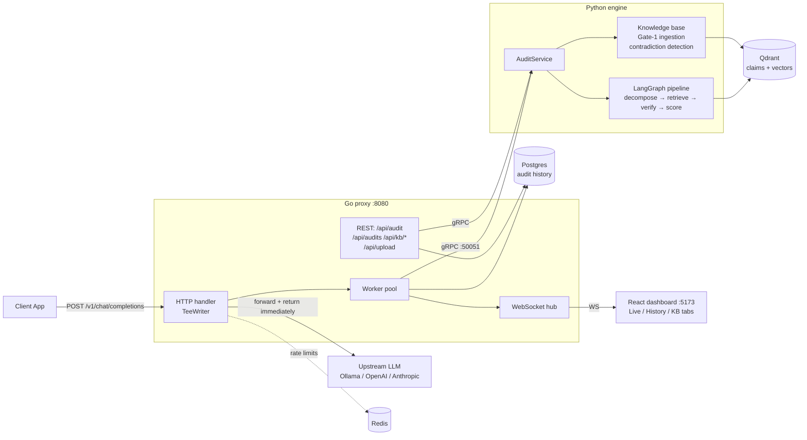
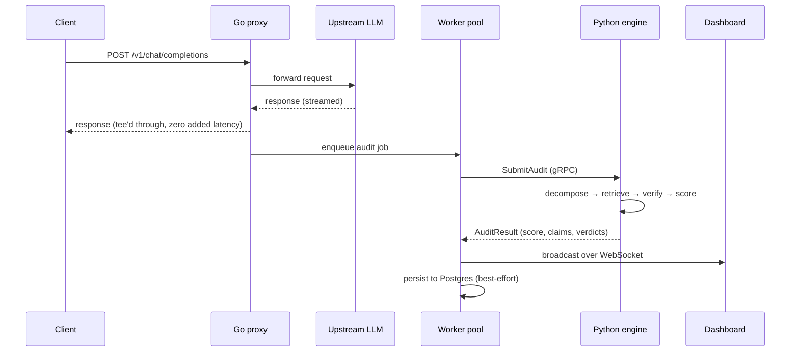

# Architecture

How TrustAgent is put together, and why it's built this way.

## System overview

## The core trick: zero-latency auditing

The proxy never makes the client wait for verification. The HTTP handler tees
the upstream LLM response: bytes stream to the client as they arrive, while a
copy lands in an async job queue. A worker pool drains the queue, calls the
Python engine over gRPC, persists the result to Postgres (best-effort), and
fans it out to dashboards over WebSocket.

## The audit pipeline (Gate-2)

A LangGraph state machine in the Python engine:

1. **Decompose** — the LLM extracts atomic claims from the response
   (strict JSON-array schema; injected/malformed output falls back safely).
2. **Retrieve** — context for each claim. Three modes, in priority order:
   caller-provided context (gRPC `AuditRequest.context`, used by the eval
   harness), hybrid BM25+dense RRF over accepted KB claims, or legacy dense
   search.
3. **Verify** — per-claim NLI against the context: SUPPORTED / UNSUPPORTED /
   PARTIALLY_SUPPORTED with confidence and evidence (strict schema; UNKNOWN
   reserved for parse failures — the model may not self-report it).
4. **Score** — confidence-weighted faithfulness score, A–F grade, and the
   hallucination decision (high-confidence unsupported claim, or >30%
   problematic claims).

## The knowledge base (Gate-1)

See [KB-DESIGN.md](KB-DESIGN.md) for the full design. The one-line version:
uploads are decomposed into claims, each claim must be *entailed by its own
source* to become retrievable (otherwise quarantined), and accepted claims
are NLI-checked against neighbors for contradictions. Together the two gates
decouple **factuality of the store** (Gate-1) from **faithfulness of the
answer** (Gate-2).

## Design decisions & trade-offs

The full ADRs live in [DECISIONS.md](DECISIONS.md); the headlines:

- **Go proxy + Python engine.** The hot path (HTTP interception, fan-out,
  rate limiting) wants Go's concurrency and small static binaries; the ML
  path (LangGraph, sentence-transformers, provider SDks) wants Python's
  ecosystem. gRPC with a committed proto contract keeps the seam honest —
  and CI builds caught a real cross-language drift (go directive vs builder
  image) precisely because both sides build from scratch on every PR.
- **Async audit, not inline guardrails.** Inline verification would add
  seconds of latency to every request. TrustAgent chooses observability over
  interception: the client is never slowed, and hallucinations surface on the
  dashboard/history within seconds. (An inline blocking mode would be a
  policy decision on top of the same pipeline.)
- **Recorded-model CI evals** (ADR-001): the golden regression gate runs the
  real pipeline against fixture-replayed LLM responses — deterministic,
  <2 min, zero cost — while live-model benchmarks run on a schedule.
- **Postgres for history, Redis for rate limits, Qdrant for claims**
  (ADR-002): each store does the one job it's the default tool for. The Go
  worker is the single Postgres writer; persistence is best-effort
  (ADR-004) so a database outage can never take down auditing.
- **Claims, not chunks** ([KB-DESIGN.md](KB-DESIGN.md)): the knowledge base
  stores entailment-verified atomic claims with provenance, because
  chunk-level stores are why "cited" gets conflated with "verified".
- **Security as enforced policy, not docs** ([SECURITY.md](SECURITY.md)):
  every control maps to the OWASP LLM Top 10 and is guarded by blocking
  scanners (gosec/bandit/npm audit) that have each caught real findings in
  this repo — including in the security module itself.

## Repository layout

| Path | What |
|---|---|
| `backend-go/cmd/proxy` | Entry point, route wiring, REST handlers |
| `backend-go/internal/{proxy,worker,websocket}` | Tee handler, audit queue, WS hub |
| `backend-go/internal/{middleware,store,grpc}` | Auth/CORS/rate-limit, Postgres, engine client |
| `backend-python/src/truthtable/graphs` | LangGraph pipeline + nodes |
| `backend-python/src/truthtable/{providers,kb,vectorstore}` | LLM providers, VERITAS-lite KB, Qdrant |
| `backend-python/src/truthtable/{security,grpc}` | Sanitization/validation, gRPC server |
| `backend-python/evals` | Two-tier eval harness, golden set, baselines |
| `frontend-react/src` | Dashboard (Live / History / Knowledge Base) |
| `proto/evaluator.proto` | Single source of truth for the Go↔Python contract |

## Testing strategy

| Layer | What guards it |
|---|---|
| Pipeline logic | Golden-set regression gate: 50 examples through the real graph with recorded model output, compared per-example against a committed baseline (blocking in CI) |
| Detector quality | Scheduled HaluEval benchmarks with live models (`eval.yml`, `make eval-benchmark`) |
| Unit behavior | 77 Python / 30 frontend / 6 Go package suites, incl. prompt-injection and planted-contradiction cases |
| Cross-language contract | CI regenerates gRPC stubs from the proto and builds both sides + all Docker images |
| Persistence | Store integration tests against a real Postgres service container on every PR |
| Security posture | Blocking gosec (medium+), bandit, npm audit; Trivy informational |
